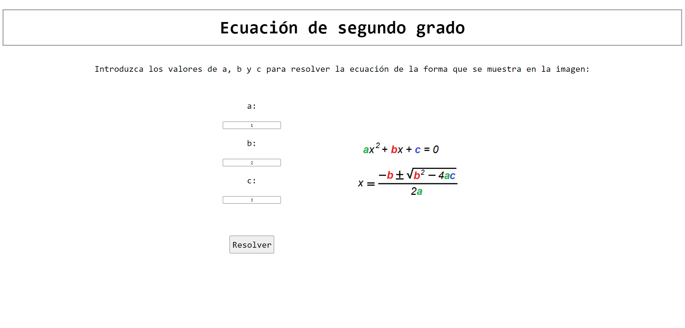
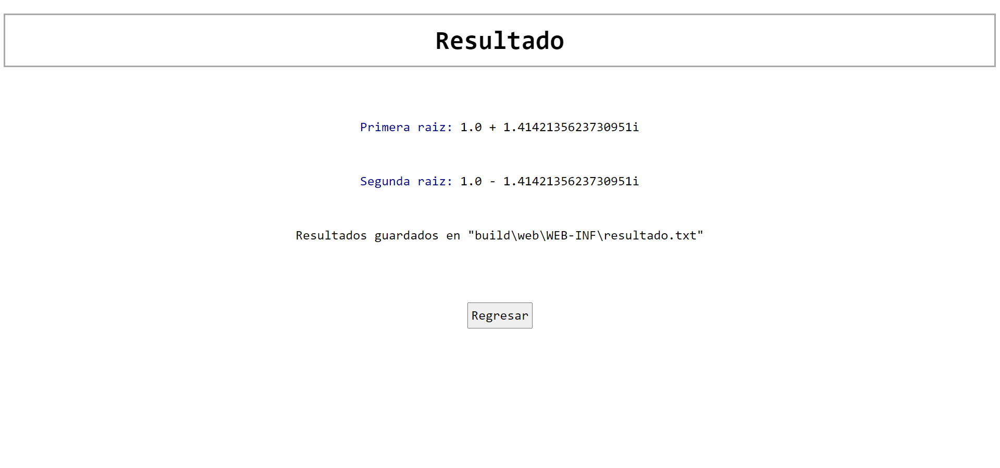

# Ecuacion2doGrado

Una app web simple en la que el usuario puede ingresar los valores de una ecuación de segundo grado...

...y luego es redirigido a una jsp con los resultados de la operación.

Además, los resultados se guardan en un txt a modo de registro.
